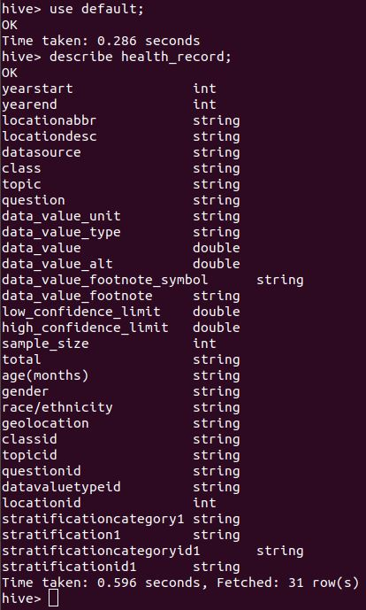
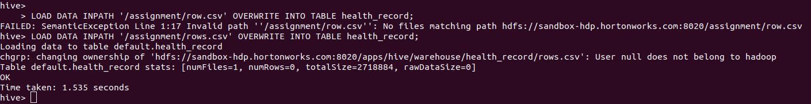
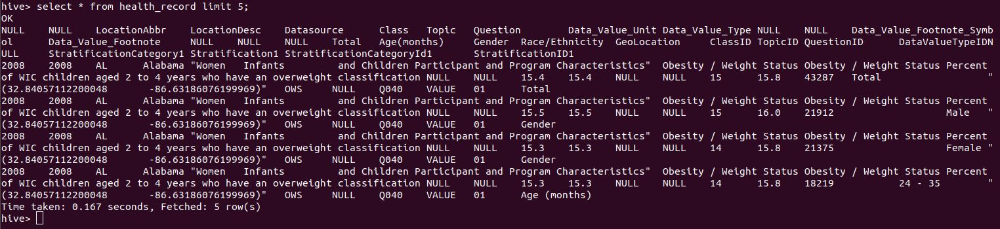
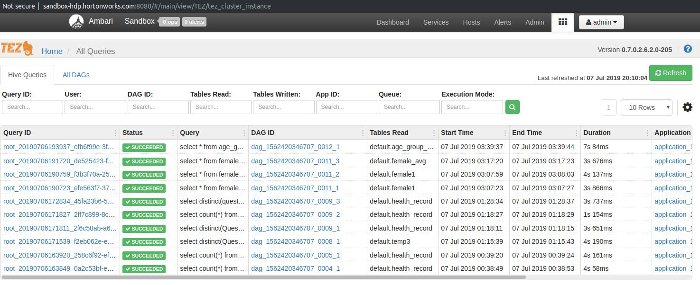

# Health Record ETL Big Data application

Automation pipeline to ingest and calculate data in BigData Platform using Hadoop HDFS, Hive, Spark.

### Prerequisites

```
Download the Hortonworks Sandbox (VirtualBox / Docker) from 
https://www.cloudera.com/downloads/hortonworks-sandbox/hdp.html
Ensure VirtualBox (v6.0) / Docker installed
Please note that a computer with minimum 10 GB RAM dedicated to the VirtualBox / Docker required
```

### Installing

1. Import Hortonworks Sandbox

Open VirtualBox and navigate to File -> Import Appliance. Select the sandbox image you downloaded and click Open.


Make sure to allocate at least 10 GB (10240 MB) of RAM for the sandbox.

Click Import and wait for VirtualBox to import the sandbox.

2. Start Hortonworks Sandbox
Once the sandbox has finished being imported, you may start it by selecting the sandbox and clicking “Start” from the VirtualBox menu.


3. A console window opens and displays the boot process. This process take a few minutes. When you see the following screen, you may begin using the sandbox.


### SSH on to HDP sandbox
ssh root@sandbox-hdp.hortonworks.com -p 2201

Default password is root/hadoop

Please remember to change password after first time login!

Run 'ambari-admin-password-reset' command to reset admin deafult password. (e.g. admin/admin)

### Access Shell Web Client

Alternatively you can access sandbox from shell web client
http://sandbox-hdp.hortonworks.com:4200/ 

The login using credentials: root / hadoop

### Access HDP sandbox UI 

Access HDP sandbox Ambari UI through http://sandbox-hdf.hortonworks.com:8080 or http://localhost:8080


User credentials:     
raj_ops / raj_ops    
maria_dev / maria_dev    
admin/admin    

### Data Ingestion

SSH to sandbox
ssh root@sandbox-hdp.hortonworks.com -p 2201

#### HDFS


1. download source data file
```
wget https://chronicdata.cdc.gov/views/735e-byxc/rows.csv
```

2. hdfs make directory
```
hdfs dfs -mkdir /assignment
```
3. copy file from local file system to hadoop destination file system
```
hdfs dfs -put rows.csv /assignment
```
4. verify file copied in hadoop
```
hdfs dfs -ls /assignment
```


#### Hive
1. Create Hive table - It create table in default schema
```
CREATE TABLE IF NOT EXISTS health_record(YearStart INT,YearEnd INT,LocationAbbr STRING,LocationDesc STRING,Datasource STRING,Class STRING,Topic STRING,Question STRING,Data_Value_Unit STRING,Data_Value_Type STRING,Data_Value DOUBLE,Data_Value_Alt DOUBLE,Data_Value_Footnote_Symbol STRING,Data_Value_Footnote STRING,Low_Confidence_Limit DOUBLE,High_Confidence_Limit  DOUBLE,Sample_Size INT,Total STRING,`Age(months)` STRING,Gender STRING,`Race/Ethnicity` STRING,GeoLocation STRING,ClassID STRING,TopicID STRING,QuestionID STRING,DataValueTypeID STRING,LocationID INT,StratificationCategory1 STRING,Stratification1 STRING,StratificationCategoryId1 STRING,StratificationID1 STRING)
COMMENT 'This is health record table'
ROW FORMAT SERDE 'org.apache.hadoop.hive.serde2.OpenCSVSerde'
tblproperties("skip.header.line.count"="1"); 
```

2. Desribe table
```
describe health_record;
```


3. Load data from HDFS into Hive table 
```
LOAD DATA INPATH '/assignment/rows.csv' OVERWRITE INTO TABLE health_record;
```


4. Check row count to verify data loaded correctly 
```
select count(*) from health_record;
```


5. Query to check table data
```
SELECT * FROM health_record limit 5;
```


We can view hive queries in Hive Query UI



### Running Spark application

1: Copy PySpark python file `health_avg_calculation.py` to HDP sandbox using Secure Copy Protocol (SCP):
```
scp ./health_avg_calculation.py root@sandbox-hdp.hortonworks.com:/root -P 2201
```

### Visualization


